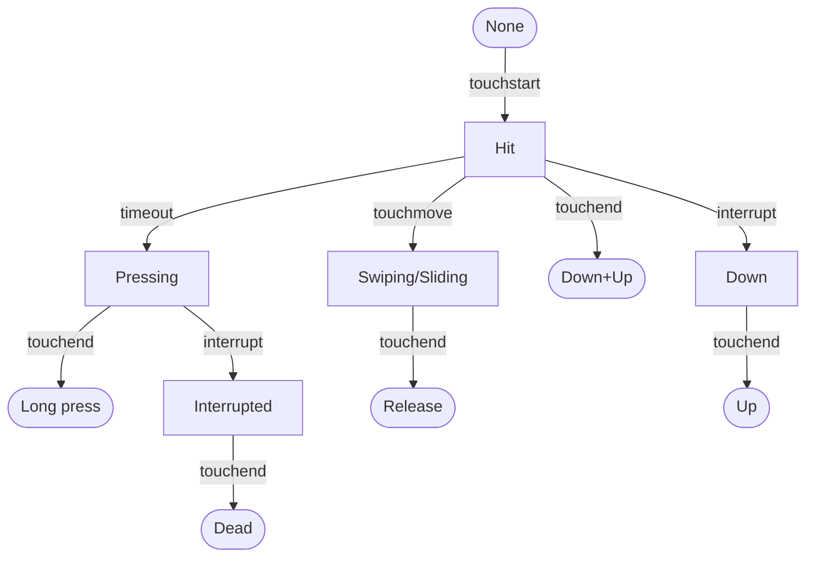

```mermaid
flowchart
  None([None]) -->|touchstart| Hit
  Hit -->|timeout| Pressing -->|touchend| LP([Long press])
  Pressing -->|interrupt| Interrupted -->|touchend| Dead([Dead])
  Hit -->|touchmove| Swiping/Sliding -->|touchend| Release([Release])
  Hit -->|touchend| CL([Down+Up])
  Hit -->|interrupt| Down -->|touchend| Up([Up])
```
* Pressing + touchmove = Moving
* Swiping + touchmove = Swiping
* Hit + slight touchmove = Hit
* Due to double-tap, Shift is handled separately
